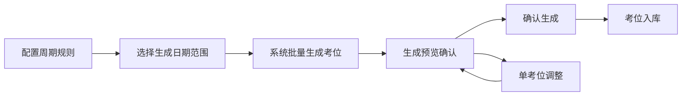
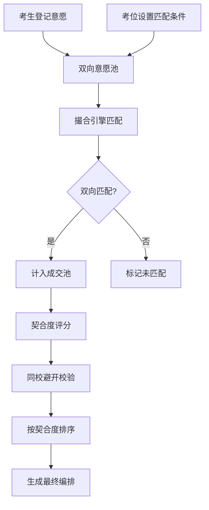

## 1. 产品概述

考场座位编排系统是一套面向考试管理机构的智能化考务管理平台，解决考位周期化生成、考生与考位双向匹配、契合度排序等核心编排问题。系统通过"考位排期、周期生成、双向撮合、契合排序"四大模块，实现考务编排的自动化、智能化与可视化。

- 目标用户：考试中心管理员、考务编排人员
- 核心价值：提升考位编排效率，确保双向匹配公平性，支持同校避开等特殊规则

## 2. 核心功能

### 2.1 用户角色

| 角色 | 注册方式 | 核心权限 |
|------|----------|----------|
| 系统管理员 | 系统预置 | 全部功能管理、数据配置、系统设置 |
| 考务编排员 | 管理员创建 | 考位管理、周期生成、双向撮合、结果查看 |

### 2.2 功能模块

1. **考位排期模块**：考位建档、考位列表、考位详情、单考位调整
2. **周期生成模块**：周期规则设定、批量生成考位、生成预览、历史周期
3. **双向撮合模块**：考生意愿登记、考位匹配条件、互选成交判定、匹配状态追踪
4. **契合排序模块**：契合度评分、同校避开编排、排序结果展示、编排导出

### 2.3 页面详情

| 页面名称 | 模块名称 | 功能描述 |
|----------|----------|----------|
| 仪表盘 | 数据概览 | 考位总数、可用考位、考生数、撮合成功率、周期进度等关键指标卡片 |
| 考位管理 | 考位建档 | 新增考位表单（考场号、座位号、容量、设备条件、所属校区等） |
| 考位管理 | 考位列表 | 考位表格展示、筛选搜索、批量操作、状态切换、单考位调整入口 |
| 考位管理 | 考位详情 | 考位基本信息、排期日历、历史编排记录 |
| 周期规则 | 规则设置 | 开放时段配置（每周几、几点到几点）、周期长度、提前生成天数、容量规则 |
| 周期生成 | 批量生成 | 选择周期范围、预览生成数量、一键生成、生成日志 |
| 周期生成 | 周期列表 | 历史周期展示、周期状态（未开始/进行中/已结束）、周期详情 |
| 考生管理 | 考生列表 | 考生信息展示、考生搜索筛选、批量导入 |
| 考生管理 | 意愿登记 | 考生选择目标考位/时段、填写偏好条件、提交意愿 |
| 考位条件 | 匹配设置 | 考位侧匹配条件配置（学历要求、专业限制、地域限制等） |
| 双向撮合 | 撮合引擎 | 双向意愿匹配、互选成交判定、匹配状态标记 |
| 契合排序 | 评分计算 | 多维度契合度评分（时间契合度、条件匹配度、优先级等） |
| 契合排序 | 排序结果 | 按契合度降序展示成交名单、同校避开标记、可调整排序 |
| 编排结果 | 最终编排 | 最终座位表展示、按考场分组、导出Excel/打印 |

## 3. 核心流程

### 3.1 考位周期生成流程

管理员先配置周期规则（每周固定开放时段），然后选择未来日期范围，系统按规则批量生成可约考位，生成后可预览和调整单个考位。

### 3.2 双向撮合编排流程

考生登记报考意愿（选择目标考位/时段），考位设置匹配条件，系统进行双向匹配，只有双方互相满足条件才成交，然后按契合度排序，同校考生避开同考场。

## 4. 用户界面设计

### 4.1 设计风格

- **设计方向**：专业严谨的政务/企业级风格，带有数据可视化的现代感
- **主色调**：深蓝 #1e3a5f（专业、信任），辅助色：青蓝 #0ea5e9（科技感）
- **强调色**：琥珀橙 #f59e0b（状态提醒），成功绿 #10b981（成交/通过），警示红 #ef4444（异常）
- **背景色**：浅灰蓝 #f1f5f9，卡片白色 #ffffff
- **字体**：标题使用"Noto Sans SC"，正文使用系统无衬线字体，字号层级清晰
- **布局风格**：左侧导航 + 顶部工具栏 + 内容区卡片式布局
- **按钮风格**：圆角中等（8px），主按钮实心深蓝，次按钮描边
- **图标风格**：线性图标，统一24px栅格

### 4.2 页面设计概述

| 页面名称 | 模块名称 | UI元素 |
|----------|----------|--------|
| 仪表盘 | 数据概览 | 4张数据卡片（考位、考生、撮合率、周期）+ 排期日历热力图 + 近期编排列表 |
| 考位管理 | 考位列表 | 顶部筛选栏 + 表格 + 分页 + 操作列（查看/编辑/调整） |
| 考位管理 | 考位详情 | 左侧信息卡 + 右侧排期时间轴 + 底部历史记录 |
| 周期规则 | 规则设置 | 表单式布局，分组展示（开放时段、周期参数、容量规则） |
| 周期生成 | 批量生成 | 日期范围选择器 + 生成预览卡片 + 操作按钮组 + 生成日志 |
| 双向撮合 | 撮合面板 | 三栏布局：左侧考生意愿池 / 中间撮合操作区 / 右侧考位条件池 |
| 契合排序 | 排序结果 | 排行榜式列表，带契合度进度条，同校高亮标记 |
| 编排结果 | 座位表 | 考场分组卡片 + 座位网格布局 + 导出按钮 |

### 4.3 响应式

- 桌面端优先设计，主内容区最小宽度1200px
- 平板端：导航收起为图标模式，表格支持横向滚动
- 移动端：底部tab导航，卡片堆叠布局，表格转为列表展示
- 触控优化：按钮最小44px触控区域，重要操作便于点击

### 4.4 动效与交互

- 页面加载：卡片渐入 + 轻微上移动画
- 撮合过程：进度条动画 + 数字滚动效果
- 状态切换：平滑过渡动画，颜色渐变
- 悬停效果：卡片微上浮 + 阴影加深
- 排序结果：契合度条形图动画填充
