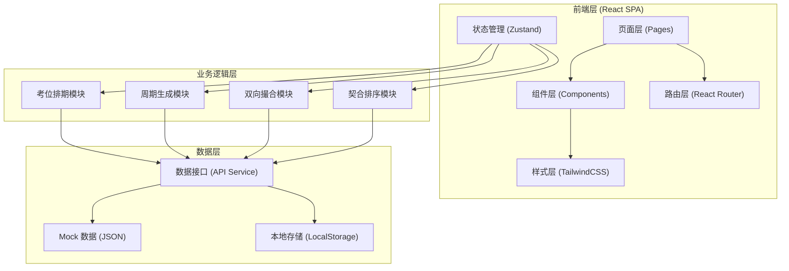

## 1. 架构设计

本项目采用前后端分离的单页应用架构，前端使用 React 18 + TypeScript + Vite，使用 Mock 数据模拟后端服务，便于本地开发与演示。



## 2. 技术描述

- **前端框架**：React@18 + TypeScript@5
- **构建工具**：Vite@5
- **样式方案**：TailwindCSS@3
- **路由管理**：React Router DOM@6
- **状态管理**：Zustand@4
- **图标库**：Lucide React
- **日期处理**：date-fns
- **UI 组件**：自定义组件（基于 TailwindCSS 构建）
- **数据模拟**：Mock JSON 数据 + LocalStorage 持久化
- **代码规范**：ESLint + Prettier

## 3. 路由定义

| 路由 | 页面 | 说明 |
|------|------|------|
| / | 仪表盘 | 数据概览、关键指标 |
| /seats | 考位管理 | 考位列表、考位建档 |
| /seats/:id | 考位详情 | 考位信息、排期日历、历史记录 |
| /cycle/rules | 周期规则 | 开放时段配置、周期参数 |
| /cycle/generate | 周期生成 | 批量生成考位、生成预览 |
| /cycle/list | 周期列表 | 历史周期、周期状态 |
| /students | 考生管理 | 考生列表、意愿登记 |
| /matching | 双向撮合 | 撮合面板、互选判定 |
| /ranking | 契合排序 | 评分结果、同校避开 |
| /result | 编排结果 | 最终座位表、导出 |

## 4. 数据模型

### 4.1 数据模型定义

```mermaid
erDiagram
    EXAM_ROOM {
        string id PK "考场ID"
        string name "考场名称"
        string building "楼栋"
        int floor "楼层"
        int capacity "容量"
        string equipment "设备条件"
        string campus "所属校区"
        string status "状态"
    }
    
    SEAT {
        string id PK "座位ID"
        string examRoomId FK "考场ID"
        string seatNumber "座位号"
        int row "行号"
        int col "列号"
        string status "状态"
    }
    
    CYCLE_RULE {
        string id PK "规则ID"
        string name "规则名称"
        json openSlots "开放时段配置"
        int cycleDays "周期天数"
        int generateAheadDays "提前生成天数"
        string capacityRule "容量规则"
        boolean isActive "是否启用"
    }
    
    SEAT_SCHEDULE {
        string id PK "排期ID"
        string seatId FK "座位ID"
        string cycleId FK "周期ID"
        date date "日期"
        string timeSlot "时段"
        string status "状态(可约/已约/停用)"
        string matchConditions "匹配条件"
    }
    
    STUDENT {
        string id PK "考生ID"
        string name "姓名"
        string idCard "身份证号"
        string school "学校"
        string major "专业"
        string education "学历"
        string region "地区"
        int priority "优先级"
    }
    
    STUDENT_WILL {
        string id PK "意愿ID"
        string studentId FK "考生ID"
        string preferredSeatId "目标考位ID"
        string preferredTimeSlot "偏好时段"
        json preferences "偏好条件"
        string status "状态"
    }
    
    MATCH_RESULT {
        string id PK "匹配ID"
        string studentId FK "考生ID"
        string seatScheduleId FK "排期ID"
        float fitScore "契合度"
        string status "状态"
        boolean sameSchoolAvoid "同校避开标记"
        int rank "排序名次"
    }
```



### 4.2 核心数据结构 TypeScript 定义

```typescript
// 考场
interface ExamRoom {
  id: string;
  name: string;
  building: string;
  floor: number;
  capacity: number;
  equipment: string[];
  campus: string;
  status: 'active' | 'inactive' | 'maintenance';
  createdAt: string;
}

// 座位
interface Seat {
  id: string;
  examRoomId: string;
  seatNumber: string;
  row: number;
  col: number;
  status: 'normal' | 'disabled';
}

// 周期规则
interface CycleRule {
  id: string;
  name: string;
  openSlots: OpenSlot[];
  cycleDays: number;
  generateAheadDays: number;
  capacityRule: 'full' | 'percentage' | 'custom';
  capacityValue?: number;
  isActive: boolean;
}

interface OpenSlot {
  weekday: number; // 0-6 周日到周六
  startTime: string; // HH:mm
  endTime: string; // HH:mm
  slotDuration: number; // 分钟
}

// 考位排期
interface SeatSchedule {
  id: string;
  seatId: string;
  examRoomId: string;
  cycleId: string;
  date: string; // YYYY-MM-DD
  timeSlot: string; // HH:mm-HH:mm
  status: 'available' | 'booked' | 'disabled';
  matchConditions: MatchConditions;
}

interface MatchConditions {
  education?: string[];
  majors?: string[];
  regions?: string[];
  schools?: string[];
}

// 考生
interface Student {
  id: string;
  name: string;
  idCard: string;
  school: string;
  major: string;
  education: string;
  region: string;
  priority: number;
  createdAt: string;
}

// 考生意愿
interface StudentWill {
  id: string;
  studentId: string;
  preferredSeatId?: string;
  preferredTimeSlot?: string;
  preferences: {
    preferredCampus?: string;
    preferredBuilding?: string;
    preferredDate?: string;
  };
  status: 'pending' | 'matched' | 'unmatched';
  submittedAt: string;
}

// 匹配结果
interface MatchResult {
  id: string;
  studentId: string;
  seatScheduleId: string;
  fitScore: number; // 0-100
  status: 'pending' | 'confirmed' | 'rejected';
  sameSchoolAvoid: boolean;
  rank: number;
  matchedAt: string;
}
```

## 5. 目录结构

```
src/
├── assets/          # 静态资源
├── components/      # 通用组件
│   ├── ui/         # 基础UI组件
│   ├── layout/     # 布局组件
│   └── charts/     # 图表组件
├── pages/           # 页面组件
│   ├── Dashboard/
│   ├── Seats/
│   ├── Cycle/
│   ├── Students/
│   ├── Matching/
│   ├── Ranking/
│   └── Result/
├── store/           # 状态管理 (Zustand)
│   ├── seatStore.ts
│   ├── cycleStore.ts
│   ├── studentStore.ts
│   └── matchStore.ts
├── services/        # API 服务层
│   ├── seatService.ts
│   ├── cycleService.ts
│   ├── studentService.ts
│   └── matchService.ts
├── mock/            # Mock 数据
│   ├── seats.ts
│   ├── students.ts
│   └── cycles.ts
├── utils/           # 工具函数
│   ├── dateUtils.ts
│   ├── matchEngine.ts
│   └── fitScore.ts
├── types/           # TypeScript 类型定义
│   └── index.ts
├── hooks/           # 自定义 Hooks
├── App.tsx
├── main.tsx
└── index.css
```

## 6. 核心算法说明

### 6.1 周期批量生成算法
- 输入：周期规则（开放时段、周期天数、起始日期）
- 输出：批量生成的 SeatSchedule 列表
- 逻辑：遍历日期范围内的每一天，根据开放时段规则匹配当天需要生成的时段，为每个座位生成对应排期记录

### 6.2 双向撮合匹配算法
- 考生侧：检查考生条件是否满足考位的 matchConditions
- 考位侧：检查考位是否在考生的意愿偏好范围内
- 判定：双方条件均满足则为双向匹配成功
- 状态：单方满足标记为"意向"，双方满足标记为"成交"

### 6.3 契合度评分算法
- 时间契合度（30%）：考生偏好时段与实际时段的匹配程度
- 条件匹配度（40%）：考位条件与考生条件的匹配项数/总项数
- 优先级加成（20%）：考生优先级加权
- 偏好匹配（10%）：校区、楼栋等偏好匹配

### 6.4 同校避开编排算法
- 遍历同校考生，检查是否被分配到同一考场
- 若同校考生在同一考场，按契合度低的考生进行重新分配
- 优先分配到相邻考场的同质量考位
- 标记 sameSchoolAvoid 状态
